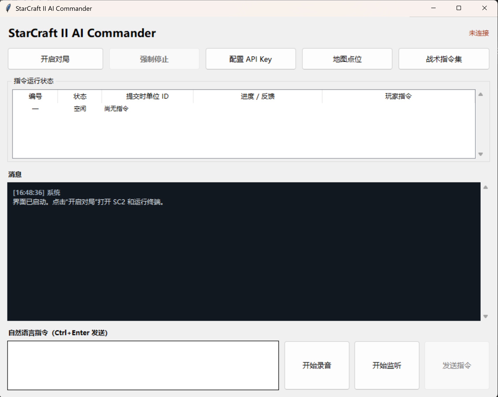

# AISC2Commander v0.1.0-beta

AISC2Commander 是一个 Windows 测试版工具，通过 Blizzard 官方 StarCraft II API 读取对局状态，并支持中文自然语言、战术指令集和语音控制。

## 系统要求

- Windows 10 或 Windows 11，64 位
- 已安装 StarCraft II
- 使用本地语音时需要互联网连接完成首次 Whisper `small` 模型下载
- 使用 OpenAI 规划或云端语音时，需要由测试者自行配置 OpenAI API Key

## 使用方法

1. 下载并完整解压 `AISC2Commander-v0.1.0-beta-win-x64.zip`。
2. 不要只复制其中一个 EXE；三个 EXE 和 `config` 目录必须保持在一起。
3. 双击 `AISC2CommanderGUI.exe`。
4. Windows SmartScreen 若显示“未知发布者”，请确认文件来自本仓库并核对 SHA-256 后再决定是否运行。
5. 点击“开启对局”，选择地图与种族。

键盘指令和本地规则不需要 API Key。本地 Whisper 首次启动会下载约 500 MB 的模型数据并保存到 `models\whisper`。OpenAI API Key 只会保存在解压目录的 `config\openai.env`。

## 反馈问题

请在公开发布仓库的 Issues 中提交问题，并附上：

- Windows 与 StarCraft II 版本
- 操作步骤和预期结果
- 界面错误文字
- 必要时附上已去除 API Key、IP 地址和个人路径的日志片段

请勿上传 API Key、完整日志、账号信息或包含个人信息的截图。

## 当前限制

- 这是 Beta 测试版，尚未进行代码签名，可能触发 SmartScreen 或杀毒软件提示。
- 本地语音模型首次下载时间取决于网络环境。
- 本项目不是 Blizzard Entertainment 的官方产品，亦未获得其背书。
- 公开仓库只用于分发测试包和收集反馈，不提供源代码授权。

使用前请阅读 `TESTING_TERMS.md` 和 `THIRD_PARTY_NOTICES.md`。
